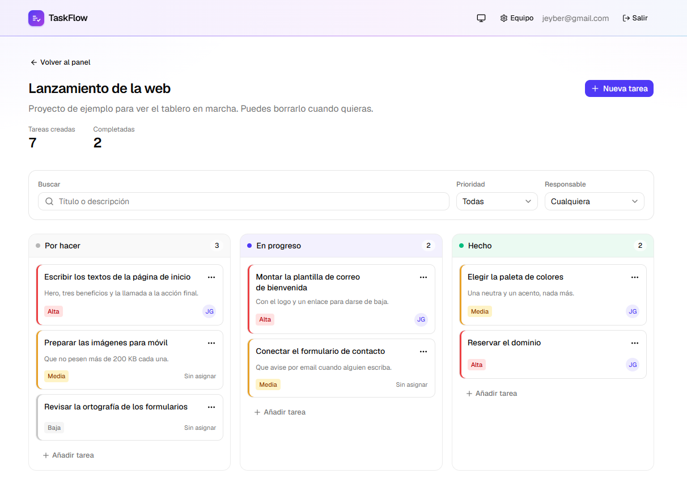
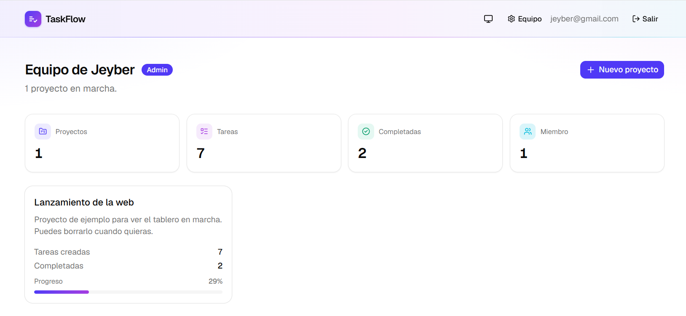
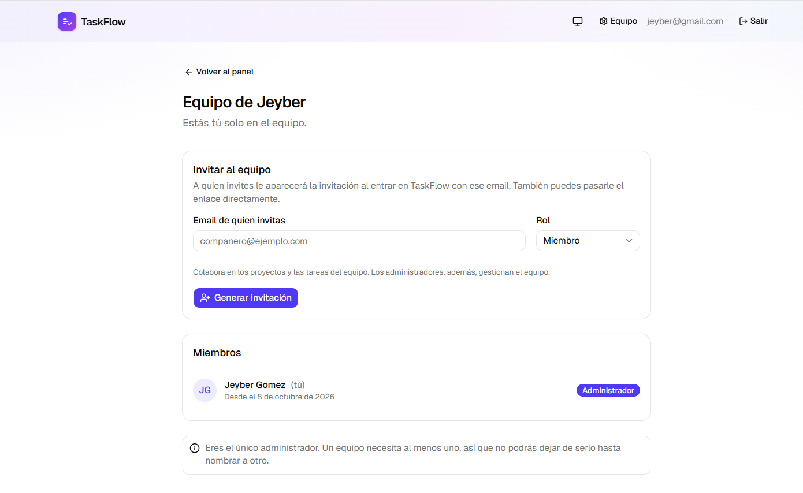
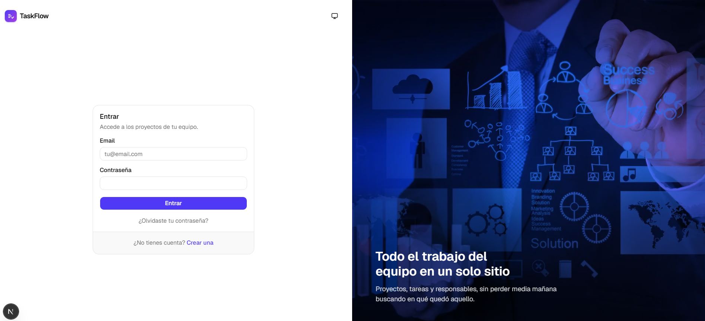

# TaskFlow

Gestor de tareas para equipos pequeños: proyectos, tablero Kanban, roles y
permisos aplicados en la propia base de datos.

> **Estado**: en construcción. Base, autenticación, modelo de datos con RLS y
> batería de tests con integración continua. Ver [roadmap](#roadmap).

- **Demo**: <https://taskflow-jg.vercel.app>
- **Blueprint del proyecto**: [`docs/proyecto-taskflow-portafolio.md`](docs/proyecto-taskflow-portafolio.md)

---

## Qué resuelve

Los equipos de tres o cuatro personas necesitan saber quién hace qué y en qué
estado está, pero las herramientas grandes piden más mantenimiento del que
ahorran. TaskFlow se queda en lo esencial: equipos con roles, proyectos y un
tablero de tres columnas con responsable y prioridad por tarea.

## Capturas



*El tablero del proyecto: tres columnas, prioridad y responsable en cada
tarea, y filtros que viven en la URL.*

| Panel del equipo | Gestión del equipo |
|:---:|:---:|
|  |  |
| Proyectos del equipo con su progreso. | Invitaciones por email o enlace y roles de cada miembro. |



## Stack y por qué

| Capa | Elección | Por qué |
|------|----------|---------|
| Framework | **Next.js 16** (App Router) + TypeScript | Front y backend en un solo repo y un solo despliegue. Los Server Components dejan las consultas a base de datos en el servidor, sin exponer credenciales. |
| Estilos | **Tailwind CSS v4** | Sin archivos de CSS que mantener en paralelo; el diseño vive junto al marcado. |
| Componentes | **shadcn/ui** (base Radix) | Componentes accesibles por defecto (foco, teclado, ARIA) que se copian al repo, así que son modificables en lugar de ser una caja negra. |
| Base de datos | **Supabase (PostgreSQL)** | Postgres gestionado en tier gratuito, con panel visual y **Row Level Security** para aplicar permisos en la base de datos, no solo en la UI. |
| Autenticación | **Supabase Auth** | Sesiones, registro y recuperación resueltos, integrados con las políticas RLS mediante `auth.uid()`. |
| Acceso a datos | **Drizzle ORM** | Consultas tipadas de extremo a extremo y migraciones versionadas en el repo, en vez de cambios manuales en un panel. |
| Validación | **Zod** | Un único esquema compartido: valida el formulario en el cliente y vuelve a validar en el servidor, donde sí importa. |
| Hosting | **Vercel** | Despliegue automático en cada push y previews por rama. |

## Cómo ejecutarlo en local

Requisitos: Node.js 20 o superior.

```bash
git clone https://github.com/jeyber-g21/TaskFlow.git
cd TaskFlow
npm install
cp .env.example .env.local   # rellena los valores de Supabase
npm run dev
```

La app queda en <http://localhost:3000>.

> Necesitas un proyecto de Supabase (tier gratuito). Las claves están en
> *Project Settings → API*. Sin ellas la app no arranca: la validación de
> entorno falla a propósito al inicio, en vez de romperse más tarde.

### Scripts

| Comando | Qué hace |
|---------|----------|
| `npm run dev` | Servidor de desarrollo |
| `npm run build` | Build de producción |
| `npm run start` | Sirve el build de producción |
| `npm run lint` | ESLint |
| `npm run db:generate` | Genera una migración a partir del esquema |
| `npm run db:migrate` | Aplica las migraciones pendientes |
| `npm run db:studio` | Abre Drizzle Studio para inspeccionar los datos |
| `npm test` | Tests unitarios (rápidos, sin dependencias externas) |
| `npm run test:rls` | Tests de permisos contra Supabase |
| `npm run test:e2e` | Recorridos completos en un navegador real |
| `npm run typecheck` | Comprobación de tipos |

## Estructura

```
src/
├── app/
│   ├── (marketing)/      # landing pública
│   ├── (auth)/           # login, registro y server actions de sesión
│   ├── (app)/            # zona privada: requiere sesión
│   │   ├── bienvenida/   # creación del primer equipo
│   │   ├── dashboard/    # proyectos del equipo
│   │   └── projects/[id]/  # tablero Kanban del proyecto
│   ├── auth/callback/    # canjea el enlace de confirmación por una sesión
│   └── layout.tsx        # fuentes, metadatos y shell de la app
├── components/
│   ├── ui/               # componentes de shadcn/ui
│   ├── auth/             # formularios de acceso
│   ├── app/              # piezas de la zona privada
│   └── marketing/        # cabecera, pie y piezas de la landing
├── lib/
│   ├── supabase/         # clientes de navegador, servidor y proxy
│   ├── db/schema.ts      # esquema de la base de datos (Drizzle)
│   ├── validations/      # esquemas Zod compartidos
│   └── env.ts            # validación de variables de entorno
└── proxy.ts              # refresco de sesión y guardia de rutas

drizzle/                  # migraciones SQL versionadas
```

## Decisiones y limitaciones conocidas

- **Los permisos viven en la base de datos.** Esconder botones en el cliente no
  es seguridad. Las cinco tablas tienen RLS, de modo que una petición que se
  salte la interfaz tampoco puede leer datos de otro equipo.
- **Drizzle define el esquema; Supabase ejecuta las consultas.** Drizzle se
  conecta como `postgres`, un rol que ignora las políticas RLS: si la aplicación
  consultara por ahí, el RLS sería decorativo. Así que Drizzle aporta lo que
  mejor hace —esquema tipado y migraciones versionadas en el repo— y las
  consultas van por el cliente de Supabase, que usa el rol `authenticated` y sí
  pasa por las políticas. Los tipos de la aplicación se siguen derivando del
  esquema de Drizzle.
- **Las funciones de permisos son `SECURITY DEFINER`.** Una política sobre
  `memberships` que consulte `memberships` provoca recursión infinita en
  Postgres. Estas funciones leen la tabla sin reactivar RLS y cortan el ciclo.
- **Tras editar o borrar se comprueba cuántas filas se tocaron.** RLS no
  devuelve error cuando bloquea una escritura: simplemente no alcanza ninguna
  fila. Sin esa comprobación, editar un proyecto ajeno parecería funcionar.
- **El equipo se resuelve en el servidor, no viaja en el formulario.** RLS
  rechazaría un identificador ajeno de todos modos, pero no hay razón para
  ofrecer el hueco.
- **Los filtros viven en la URL, no en el estado de un componente.** Así un
  tablero filtrado se puede compartir por chat, sobrevive a una recarga y el
  botón de atrás hace lo que se espera. Como vienen de fuera, se validan igual
  que cualquier entrada: `?prioridad=urgentisima` se ignora en vez de romper la
  página.
- **El filtrado ocurre en Postgres.** Traerse todas las tareas para descartarlas
  en JavaScript funciona con veinte y se desmorona con dos mil.
- **Las tareas se mueven por menú, no arrastrando.** El arrastre luce en una
  demo, pero no funciona con teclado y es incómodo en móvil. El menú deja la
  funcionalidad completa y accesible; el arrastre puede añadirse encima más
  adelante, no en su lugar.
- **Mover una tarea es su propia acción**, no una edición completa: el tablero
  manda solo el estado nuevo, sin arrastrar el resto de campos ni arriesgarse a
  pisar un cambio que otra persona acabe de hacer.
- **Las invitaciones llegan por dos caminos a la vez.** Un enlace con código
  para compartir por donde sea, y la propia invitación esperando a quien entre
  con el email al que se invitó. Sin dependencia de un servidor de correo.
- **El email de las invitaciones propias sale del token de sesión**, nunca de
  un parámetro. Si se pasara por argumento, cualquiera podría preguntar por el
  correo de otra persona y averiguar a qué equipos la han invitado.
- **Irse del equipo nunca falla; dejar de ser administrador, sí.** Son cosas
  distintas: lo primero ocurre también al borrar una cuenta, así que si se va
  el último administrador la administración pasa al miembro más antiguo. Lo
  segundo es deliberado y se rechaza si nadie queda al mando.
- **Crear un equipo es una función, no un `INSERT`.** `create_team()` crea el
  equipo y su primer administrador en una sola operación: un equipo recién
  insertado no tendría miembros, y entonces ninguna política podría decidir
  quién tiene derecho a añadir el primero.
- **Validación duplicada a propósito.** El mismo esquema de Zod corre en el
  cliente (respuesta inmediata) y en el servidor (la que de verdad protege).
- **La sesión se valida con `getUser()`, no con `getSession()`.** El segundo
  lee la cookie sin comprobarla contra Supabase, así que es falsificable.
- **Rutas protegidas por partida doble.** El proxy redirige a quien no tiene
  sesión, y el layout privado vuelve a comprobarlo. Si algún día cambia el
  `matcher` del proxy, las rutas no quedan expuestas por accidente.
- **La confirmación por email está desactivada a propósito.** El correo que
  incluye el plan gratuito de Supabase está pensado solo para pruebas y limita
  los envíos por hora, así que en una demo pública alguien podría registrarse y
  no recibir nunca el enlace. La ruta `/auth/callback` que canjea el código por
  una sesión sigue implementada, porque es la misma que usa la recuperación de
  contraseña y porque reactivar la confirmación es cambiar un interruptor.
- **Los tests se escriben con cada fase, no al final.** Dejarlos para el cierre
  suele acabar en dos pruebas simbólicas escritas con prisa.

## Tests

Tres niveles, separados a propósito por lo que cuesta ejecutarlos:

| Qué | Cuántos | Qué comprueban |
|-----|---------|----------------|
| **Unitarios** (Vitest) | 58 | Esquemas de validación y traducción de errores. Segundos, sin red. |
| **Permisos** (Vitest) | 32 | RLS contra Supabase real: dos usuarios, uno intenta leer y escribir en el equipo del otro. |
| **Recorridos** (Playwright) | 49 | Registro, equipo, proyectos, tablero, roles, invitaciones, filtros, tema y recuperación de contraseña en un navegador real. |

Los de permisos son el corazón de la batería. Registran dos usuarios, uno monta
su equipo con proyecto y tarea, y el otro intenta leerlo —incluso pidiendo la
tarea por su `id`—, modificarlo, borrarlo y añadirse al equipo. Postgres rechaza
todo con el código `42501`. Al terminar, los usuarios de prueba se borran solos.

Los unitarios corren sin configuración. Los otros dos necesitan las variables de
entorno; si faltan, los de permisos se saltan en lugar de fallar.

### Integración continua

Cada push ejecuta lint, tipos y unitarios. Si el repositorio tiene configurados
los secretos de Supabase, corre además los de permisos y los recorridos, estos
últimos contra el build de producción y no contra el servidor de desarrollo.

Un segundo workflow despierta Supabase cada tres días: el plan gratuito pausa
los proyectos inactivos, y sin eso la demo se cae sola pasada una semana.

### Si Vitest falla con "Cannot find native binding"

Es un [fallo conocido de npm](https://github.com/npm/cli/issues/4828) con las
dependencias nativas opcionales: aparece tras instalar cualquier paquete nuevo.
Se arregla reinstalando desde cero:

```bash
rm -rf node_modules package-lock.json && npm install
```

## Roadmap

- [x] **1. Base** — Next.js + TypeScript + Tailwind + shadcn/ui, landing y deploy inicial
- [x] **2. Auth** — registro, login, logout y rutas protegidas con Supabase
- [x] **3. Datos** — tablas, políticas RLS y Drizzle conectado
- [x] **4. Equipos y proyectos** — workspace al registrarse y CRUD de proyectos
- [x] **5. Tareas** — CRUD de tareas y vista Kanban
- [ ] **6. Roles e invitaciones** — permisos de admin y miembro
- [ ] **7. Pulido** — estados vacíos, carga, errores, responsive y modo oscuro
- [x] **8. Filtros y búsqueda** — por responsable, prioridad y texto
- [x] **9. Tests** — unitarios, permisos y recorridos completos, más CI en GitHub Actions

---

Proyecto de portafolio de Jeyber Gómez.
